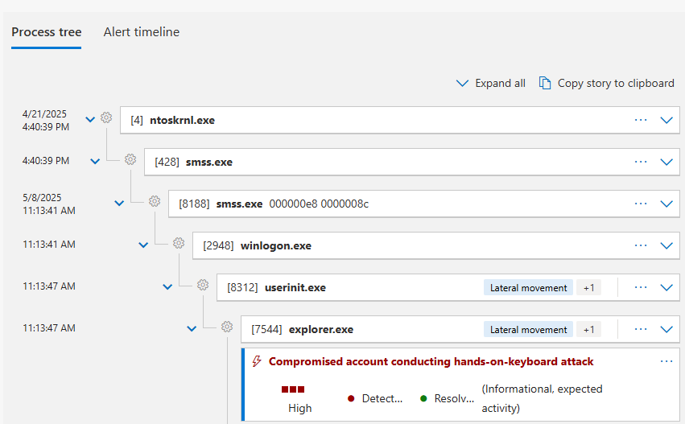
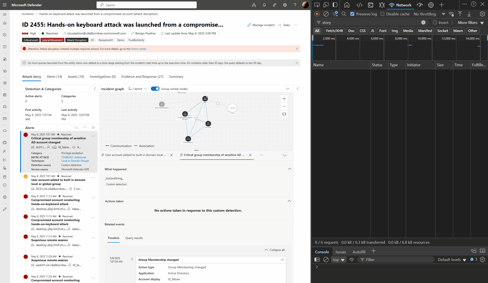
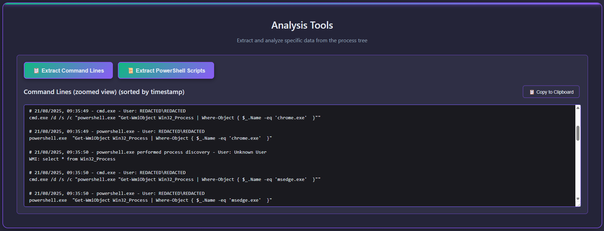

# XDR Story Parser - Process Tree Visualizer

The XDR Story Parser helps you to parse attack stories from Microsoft Defender XDR and further work with them outside of the XDR portal.

XDR alert stories are a special JSON format that Microsofts uses in the Defender XDR portal to display a process tree and the alert timeline like this.

> [!Note]
> This code contains large portions of LLM generated code. Use at your own risk and don't blame me too hard.

## Extract attack story

1. Open the incident in the Defender XDR portal
2. Open the **developer tools** in your browser
3. Switch to the **network tab**
4. Add a filter for the word **story**
5. Select one of the alerts you expect to be from Defender for Endpoint
6. If you see the story element in the network tab of the Developer Tools fo to the Preview tab
7. Right click in the top and select **Copy object**
8. Save the content as `json` or `jsonc` on your hard drive

## Work with XDR Story Parser

You can either clone the [GitHub repository](https://github.com/f-bader/XDRStoryParser) and open the index.html directly in your browser, or you can visit the repos [GitHub Pages](https://f-bader.github.io/XDRStoryParser/).

### Redact sensitive information

By default the JSON file contains sensitive information like user-, computer-, and domainnames. You can use the anonymize feature to replace all of the occurrences with the word **REDACTED**. This makes safer to share those JSON files to other people or store them for later use.

Certain well known SIDs and Usernames are never redacted, as they are universal and not environment specific.

You can download the redacted version of the JSON for later use.

> [!WARNING]  
> IP addresses are currently not part of the redacted data

> [!CAUTION]
> While I tried to test a lot of alerts, there might be edge cases were the data is not redacted. Use at you own risk and validate the results.

## Zoom into the process tree

If you don't need all the information of the process tree, but want to focus only a particular part you can easily zoom in and hide the rest.

### Extract PowerShell scripts

Working with segmented PowerShell scripts in the original view can be a pain. XDR Story Parser let's you easily extract all PowerShell scripts from the alert story. The data will include comments with date, time and the user executing the script.

> [!Tip]
> The extract PowerShell scripts function honors the current zoom setting

## Extract command lines

Similar to PowerShell scripts you can also export command lines for use outside of the alert story.

> [!Tip]
> The extract PowerShell scripts function honors the current zoom setting

## Process tree screenshot

If you click **Screenshot** the complete process tree will be screenshotted and downloaded. This makes it super easy to share certain parts of the alert story as you want to present them.

> [!Tip]
> The screenshot function honors the current zoom setting

## Attribution

A big thank you to Christopher Hackenschmidt, for showing me the `story` API endpoint in the first place. Without his inspiration I would have not built this tool.
